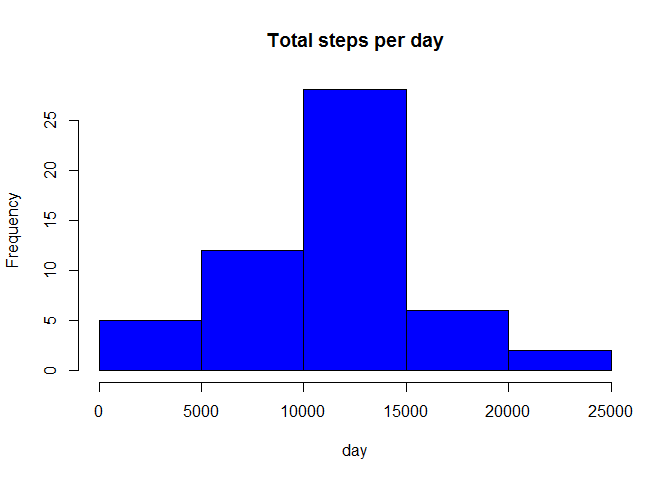
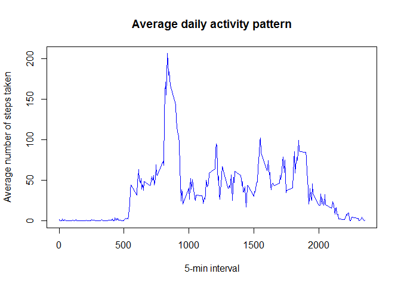
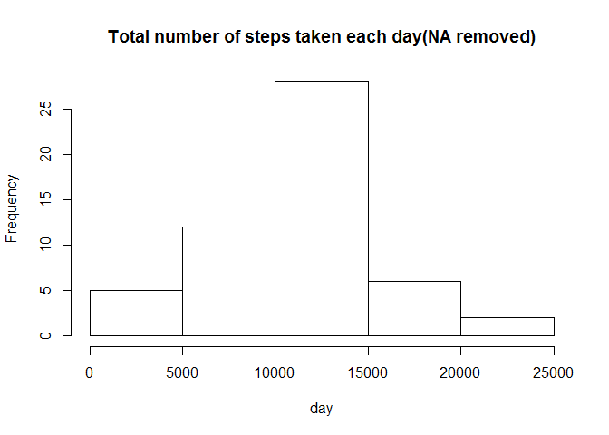
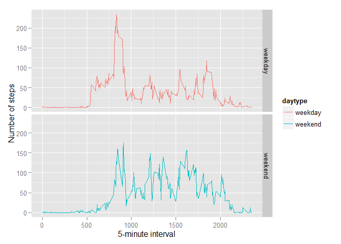

# Reproducible Research: Peer Assessment 1

##Loading and preprocessing the data

```r
activitydata<-read.csv("activity.csv")
head(activitydata)
```

```
##   steps       date interval
## 1    NA 2012-10-01        0
## 2    NA 2012-10-01        5
## 3    NA 2012-10-01       10
## 4    NA 2012-10-01       15
## 5    NA 2012-10-01       20
## 6    NA 2012-10-01       25
```

```r
colnames(activitydata)
```

```
## [1] "steps"    "date"     "interval"
```


##What is mean total number of steps taken per day?

```r
Totalsteps_day<-aggregate(steps~date, data=activitydata, sum)
hist(Totalsteps_day$steps, col="blue", main="Total steps per day", xlab="day")
```

 

```r
mean(Totalsteps_day$steps)
```

```
## [1] 10766.19
```

```r
median(Totalsteps_day$steps)
```

```
## [1] 10765
```


##What is the average daily activity pattern?

```r
Avgdailyactv<-tapply(activitydata$steps,activitydata$interval,mean,na.rm=TRUE)
plot(x=names(Avgdailyactv),y=Avgdailyactv, type = "l", xlab = "5-min interval", 
     ylab = "Average number of steps taken", main = "Average daily activity pattern", 
     col = "blue")
```

 


##Imputing missing values
Calculate and report the total number of missing values in the dataset 

```r
Avgdailyactv[Avgdailyactv==max(Avgdailyactv)]
```

```
##      835 
## 206.1698
```

```r
activitydata_missing<-sum(is.na(activitydata))
activitydata_missing
```

```
## [1] 2304
```

Filling in all of the missing values in the dataset used: the mean for that 5-minute interval

```r
Totalsteps_interval <- aggregate(steps ~ interval, data = activitydata, FUN = mean)
for (i in 1:nrow(activitydata)) {
  value <- activitydata[i, ]
  if (is.na(value$steps)) {
    steps <- subset(Totalsteps_interval, interval == value$interval)$steps
  } else {
    steps <- value$steps
  }

}
Totalsteps_day_NA.rm<- aggregate(steps ~ date, activitydata, sum)
```

Draw a histogram of the value and calculate mean and median

```r
hist(Totalsteps_day_NA.rm$steps, main = "Total number of steps taken each day(NA removed)", xlab = "day")
```

 

```r
mean(Totalsteps_day_NA.rm$steps)
```

```
## [1] 10766.19
```

```r
median(Totalsteps_day_NA.rm$steps)
```

```
## [1] 10765
```


## Are there differences in activity patterns between weekdays and weekends

```r
daytype <- function(date) {
  if (weekdays(as.Date(date)) %in% c("Saturday", "Sunday")) {
    "weekend"
  } else {
    "weekday"
  }
}
activitydata$daytype <- as.factor(sapply(activitydata$date, daytype))
library(ggplot2)

steps_per_day_na.rm <- aggregate(steps ~ interval+daytype, activitydata, mean)

ggplot(steps_per_day_na.rm, aes(interval, steps)) + geom_line(aes(color=daytype)) + facet_grid(daytype ~ .) + 
  xlab("5-minute interval") + ylab("Number of steps")
```

 


